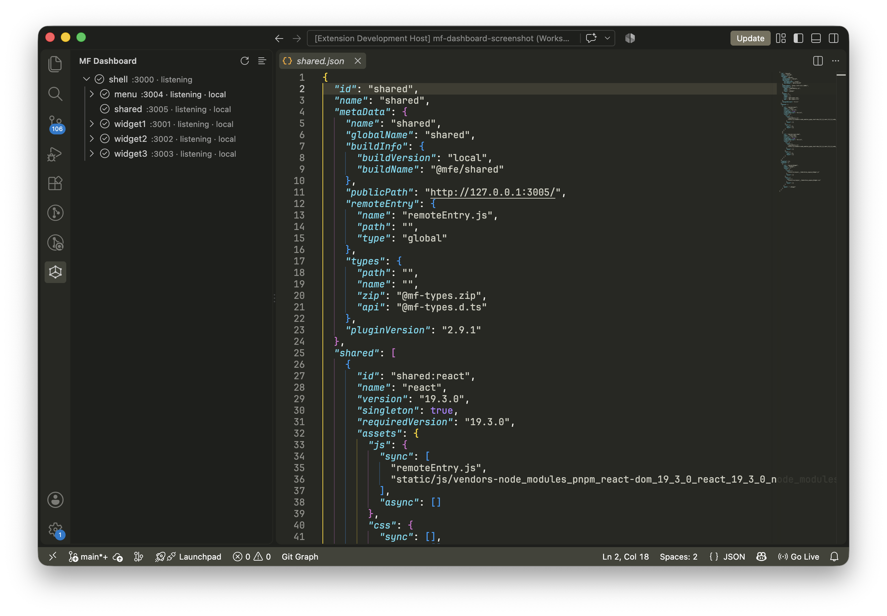

# MF Dashboard

[English](README.md) | [Русский](README.ru.md)

MF Dashboard is a VS Code extension for working with Module Federation microfrontends. From the MF Dashboard panel, you can monitor applications and their remote dependencies, start local applications, update types, and open configurations and manifests.



## Installation

1. `.vsix`: install from [GitHub Releases](https://github.com/megahoma/mf-dashboard/releases).

## Features

1. **Automatic discovery** of microfrontend configurations.
2. **Work with multiple projects** in one VS Code window.
3. **Tree or flat list** of applications and remote dependencies.
4. **Periodic checks** of ports, manifests, and types ZIP archives.
5. **Availability checks** for external manifests.
6. **Start local applications** through `package.json` scripts.
7. **Update and rebuild types**: download consumer `@mf-types` and generate types for local producers.
8. **Context-menu navigation** to configurations, the types directory, and the JSON manifest.
9. **URL and types diagnostics in Problems** with links to the consumer configuration or workspace settings.

### Statuses

| Status                      | Meaning                                                                          |
| --------------------------- | -------------------------------------------------------------------------------- |
| `listening`                 | The local app's port is open.                                                    |
| `stopped`                   | The local port is closed or not declared.                                        |
| `types not rebuilt`         | Producer sources are newer than the types ZIP and the settle period has elapsed. |
| `types not updated`         | The consumer's types are missing or do not match the remote ZIP.                 |
| `URL error`                 | The URL is empty, has unresolved variables, or is not HTTP(S).                   |
| `non-local URL`             | A link to a local app points to another host.                                    |
| `different port`            | The link URL points to a different port.                                         |
| `reachable` / `unreachable` | An external manifest answered or failed to answer.                               |

A root app's status comes from its local port. A link also checks types and its URL, so the same app can have different statuses in different rows. Closed local ports take priority, followed by types issues, then URL issues. With `consumeTypes: false`, types issues do not affect the link status.

URL issues and unreachable external manifests appear as warnings in Problems. Types issues appear as information; listening, stopped, and reachable rows do not add diagnostics.

## Detection

The extension activates on startup and looks for these config files:

| Config family     | File name                    |
| ----------------- | ---------------------------- |
| Module Federation | `module-federation.config.*` |
| Webpack           | `webpack.config.*`           |
| Rspack            | `rspack.config.*`            |
| Rsbuild           | `rsbuild.config.*`           |
| Vite              | `vite.config.*`              |

Supported extensions are `.mjs`, `.cjs`, `.js`, `.mts`, `.cts`, `.ts`, `.jsx`, and `.tsx`. Discovery parses source without executing the config. It recognizes `pluginModuleFederation`, `ModuleFederationPlugin`, and `createModuleFederationConfig`, including supported helpers imported from the same package. Arbitrary runtime logic may not resolve.

The local port comes from `server.port` or `devServer.port`. Remote URLs may use `process.env` or `import.meta.env` values from `.env.<mode>` and `.env.<mode>.local`; the local file takes precedence. The default manifest path is `/mf-manifest.json`.

Discovery skips `node_modules`, `.git`, `dist`, and `mf-dashboard.ignorePaths`. It adds missing app names without overwriting saved entries. Once `mf-dashboard.apps` exists, even as an empty object, startup reloads that list instead of scanning for new apps. An empty scan writes no settings and an explicit search with no loaded apps shows a notification.

Multi-root workspaces are scanned folder by folder. Federation names and workspace-folder names must be unique. Settings are stored in `.vscode/settings.json` for a folder opened on its own, or in the saved `.code-workspace` file.

Refresh reads known app directories and reuses parsed configs until a config, active env file, or tracked local import changes size or mtime. The tree keeps its previous results until a probe succeeds. Each successful cycle shares ZIP downloads by URL; later cycles use `If-Modified-Since` when available and reuse hashes on 304. Manifests are requested separately for each row.

Saving a producer's included `.ts` or `.tsx` source in VS Code refreshes the local types estimate immediately and after `typesSettleMs`, without network requests. Periodic probes also cover changes outside the editor. Cache entries use file size and mtime; an edit preserving both may leave the previous result cached.

## Supported package versions

| Package                             | Version / scope                                             |
| ----------------------------------- | ----------------------------------------------------------- |
| VS Code                             | `^1.90.0`, required by the extension manifest.              |
| `@module-federation/enhanced`       | `2.9.1` in the integration workspace used for verification. |
| `@module-federation/rsbuild-plugin` | `2.9.1` in the integration workspace used for verification. |

Built-in type generation uses the Module Federation 2.9.1 API through project-local `@module-federation/enhanced`, `@module-federation/cli`, and `@module-federation/dts-plugin`. It loads the config and captures Rsbuild plugin options. Config detection for other bundlers does not guarantee that their configs work with this generator.

Package versions are not checked against a semver matrix at runtime. Compatibility with other versions is not established. If built-in generation cannot use your config or plugin API, set `mf-dashboard.commands.rebuildTypes` to your project's generation command. Discovery itself does not require these packages to be loaded.

## Settings

All settings use the `mf-dashboard.*` namespace.

| Setting                              | Default       | Description                                                                                                                |
| ------------------------------------ | ------------- | -------------------------------------------------------------------------------------------------------------------------- |
| `mf-dashboard.envMode`               | `development` | Mode for `.env.<mode>` and `.env.<mode>.local`.                                                                            |
| `mf-dashboard.structure`             | `tree`        | `tree` or `flat`; also controlled by the view-title button.                                                                |
| `mf-dashboard.language`              | `auto`        | Tree labels and tooltips: `auto`, `en`, or `ru`. Command titles follow VS Code.                                            |
| `mf-dashboard.ignorePaths`           | `[]`          | Additional scan exclusions. A name matches at any depth; a relative path excludes that subtree. Saved apps are still read. |
| `mf-dashboard.extraManifestUrls`     | `[]`          | External manifest URLs shown as root rows. Only valid HTTP(S) URLs are requested.                                          |
| `mf-dashboard.packageManager`        | `auto`        | Start command manager: `auto`, `npm`, `pnpm`, `yarn`, or `bun`.                                                            |
| `mf-dashboard.probeIntervalMs`       | `5000`        | Interval between port, manifest, and ZIP checks in milliseconds; minimum `1000`.                                           |
| `mf-dashboard.typesSettleMs`         | `15000`       | Delay after saving source before types can count as stale, in milliseconds.                                                |
| `mf-dashboard.terminal.reveal`       | `true`        | Show the terminal when starting an app.                                                                                    |
| `mf-dashboard.scripts.start`         | `dev`         | `package.json` script key for Start when the app has no override.                                                          |
| `mf-dashboard.commands.rebuildTypes` | `""`          | Command replacing built-in type generation. Empty uses the plugin API.                                                     |
| `mf-dashboard.commands.refetchTypes` | `""`          | Command replacing built-in types download. The 60-second timeout and result checks still apply.                            |
| `mf-dashboard.apps`                  | absent        | Saved apps. First open discovers apps when absent; an empty object disables startup discovery.                             |

Example app entry:

```json
{
  "mf-dashboard.apps": {
    "shell": {
      "path": "apps/shell",
      "manifestPath": "/mf-manifest.json",
      "scripts": { "start": "dev" }
    }
  }
}
```

`path` is relative to the workspace folder; paths outside it are ignored. Multi-root entries can specify `workspaceFolder` by name. `manifestPath` defaults to `/mf-manifest.json`. An app's `scripts.start` overrides the global setting; discovery sets `dev` for new entries.

With `packageManager: auto`, Start reads the root `packageManager` field, then checks `pnpm-lock.yaml`, `yarn.lock`, `bun.lock` / `bun.lockb`, and `package-lock.json`, falling back to npm. The command is `<manager> run <script>`; a missing script or invalid script key starts no process.

## License

[MIT](LICENSE).
